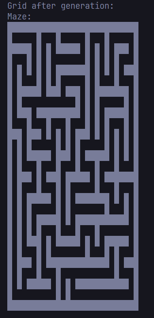
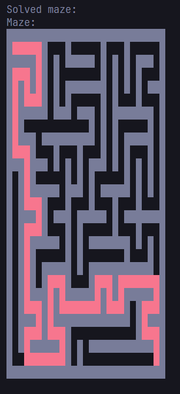

## Sample images from running application
# Unsolved generated 25x25 maze 


# Generated 25x25 maze with solved path in red 


## How to use this Rust Maze Generator
- Clone this repository
- If you have the rust environment installed already on local do the below:
    - ``` cargo run ```
    - Then the application will prompt you to enter a height and width you wish to make the maze
    - This will generate a solvable maze, entrance on the top left and exit on the bottom right

- If you do not have the rust environment installed locally, you can use my Dockerfile to build a container from the official Rust [Docker image](https://hub.docker.com/_/rust/) and use the following commands to create and enter the container terminal to run the application

```bash
docker build -t my-rust-app .
docker run -it --rm --name my-running-app my-rust-app
```

